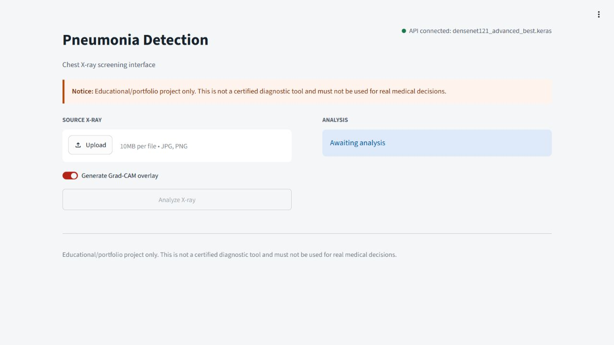
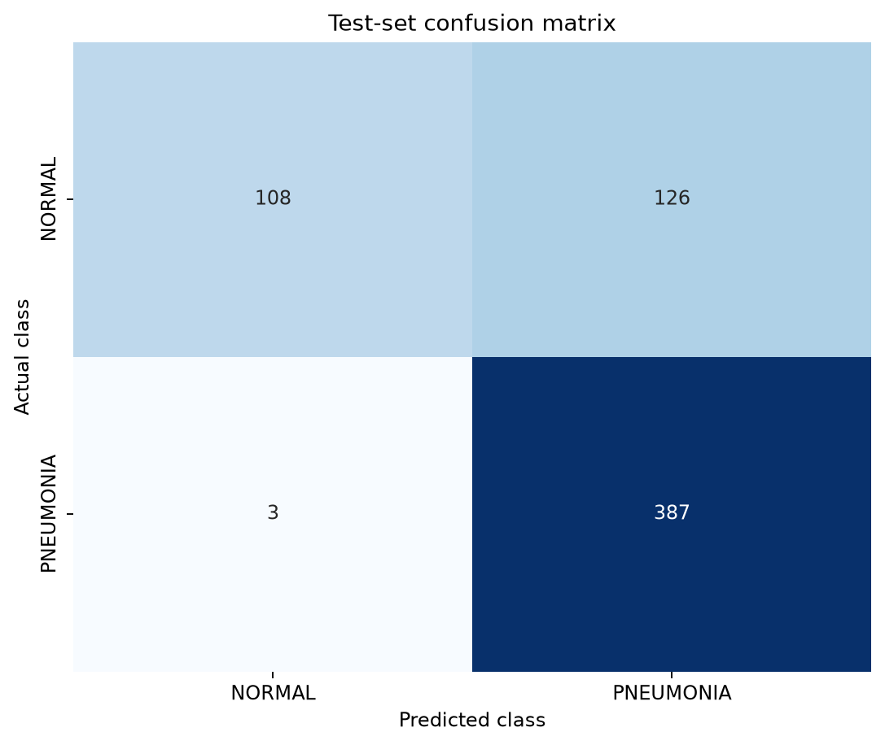
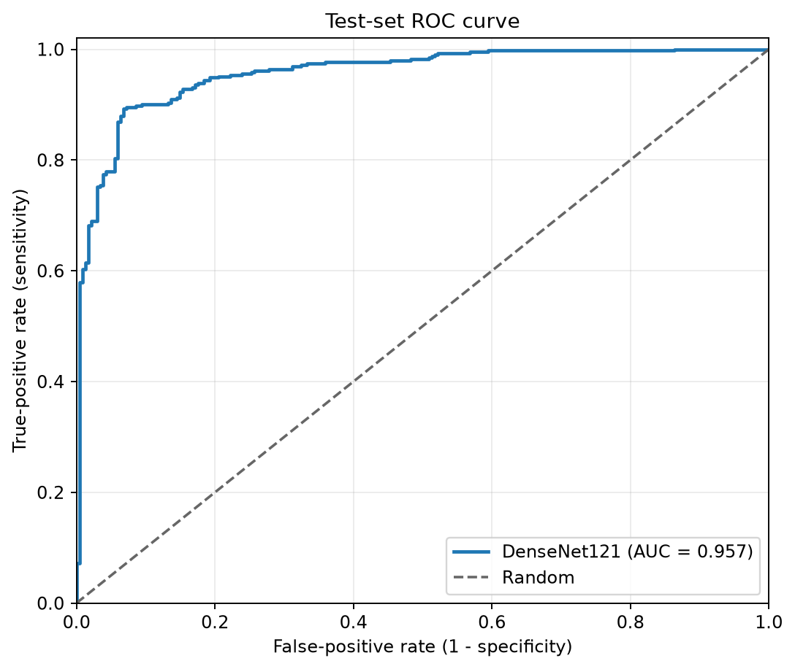
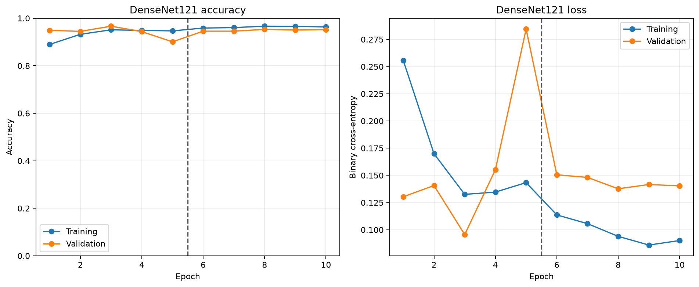
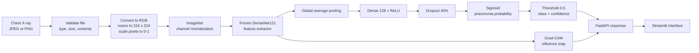

# Pneumonia Detection System

[](https://github.com/MdRedwanIslam1/pneumonia-detector/actions/workflows/ci.yml)


> [!WARNING]
> **Medical disclaimer:** This is an educational/portfolio project, not a
> certified diagnostic tool. It must not be used for real medical decisions.

An end-to-end binary image-classification project that predicts `NORMAL` or
`PNEUMONIA` from a chest X-ray. The repository covers data validation,
preprocessing, a CNN baseline, DenseNet121 transfer learning, Grad-CAM,
medical-model evaluation, FastAPI, Streamlit, Docker, Railway deployment,
MLflow experiment tracking, and continuous integration.

**[Open the live demo](https://pneumonia-detector-production-649a.up.railway.app/)**
| **[View CI runs](https://github.com/MdRedwanIslam1/pneumonia-detector/actions)**
| **[Read the portfolio notes](docs/PORTFOLIO.md)**



The demo accepts JPEG or PNG images and can return a Grad-CAM overlay. It is a
technical demonstration only, not a screening or diagnosis service.

## Project Summary

The project asks a binary classification question: given one chest X-ray,
which of two dataset labels is more likely, `NORMAL` or `PNEUMONIA`? A
from-scratch CNN establishes a baseline. A pretrained DenseNet121 then reuses
general visual features learned from ImageNet and trains a new binary
classification head for this dataset.

The selected model prioritizes sensitivity and misses very few pneumonia
examples, but it produces many false positives. Reporting that limitation is
as important as reporting its strongest metric.

### Final held-out test results

The following values come from the untouched Kaggle test split of 624 images
using the predefined `0.5` decision threshold.

| Metric | Result | What it means here |
| --- | ---: | --- |
| Accuracy | 79.33% | Overall fraction classified correctly |
| Precision | 75.44% | Fraction of pneumonia predictions that were correct |
| Recall / sensitivity | **99.23%** | Detected 387 of 390 pneumonia images |
| Specificity | 46.15% | Correctly rejected 108 of 234 normal images |
| F1-score | 85.71% | Balance between precision and recall |
| ROC-AUC | **95.72%** | Ranking quality across all possible thresholds |

| Confusion matrix | ROC curve |
| :---: | :---: |
|  |  |

At threshold `0.5`, the model produced 108 true negatives, 126 false
positives, 3 false negatives, and 387 true positives. The 99.23% sensitivity
is encouraging for this experiment, while the 46.15% specificity is far too
low for clinical use. A future threshold must be selected on validation data,
then assessed on a fresh holdout or external dataset.

### Model comparison

| Model | Validation accuracy | Precision | Recall | Loss |
| --- | ---: | ---: | ---: | ---: |
| Baseline CNN | 88.63% | **98.24%** | 86.23% | 0.2381 |
| DenseNet121, frozen | **96.66%** | 97.56% | **97.94%** | **0.0956** |
| DenseNet121, fine-tuned | 95.32% | **99.46%** | 94.21% | 0.1377 |
| Focal-loss candidate | 94.65% | 99.45% | 93.31% | 0.1677 BCE comparison |

The frozen DenseNet121 checkpoint was retained because it had the strongest
combination of validation loss, accuracy, and recall. Fine-tuning and focal
loss were evaluated rather than assumed to be improvements.



## Dataset

The project uses Paul Mooney's
[Chest X-Ray Images (Pneumonia)](https://www.kaggle.com/datasets/paultimothymooney/chest-xray-pneumonia)
dataset from Kaggle.

| Split supplied by dataset | Normal | Pneumonia | Total |
| --- | ---: | ---: | ---: |
| Train | 1,341 | 3,875 | 5,216 |
| Validation | 8 | 8 | 16 |
| Test | 234 | 390 | 624 |
| **Total** | **1,583** | **4,273** | **5,856** |

There are about 2.70 pneumonia images for every normal image. To reduce bias
toward the majority class, training uses balanced class weights. The supplied
validation folder contains only 16 images, so the original train and validation
folders are combined and split again with a reproducible, stratified 80/20
development split:

| Working split | Normal | Pneumonia | Total |
| --- | ---: | ---: | ---: |
| Train | 1,079 | 3,106 | 4,185 |
| Validation | 270 | 777 | 1,047 |
| Untouched test | 234 | 390 | 624 |

The exploration script checked all 5,856 files: none were corrupted, all were
JPEG images, and their varying sizes were normalized by preprocessing. The
dataset itself is excluded from Git.

## Architecture



The preprocessing code converts grayscale and RGB files into the same
three-channel shape, resizes them to `224 x 224`, and scales pixel values to
`0-1`. During training only, conservative rotation, zoom, brightness changes,
and horizontal flips add variation. Vertical flips and severe distortions are
excluded because they create anatomically unrealistic images.

DenseNet121 acts as the feature extractor. Its output is summarized by global
average pooling and passed through a small classification head. The sigmoid
output is a number between 0 and 1 interpreted as pneumonia probability. The
API applies a fixed threshold to produce the displayed class.

Grad-CAM highlights image regions that influenced a prediction. It is useful
for debugging model attention, but it neither proves that the model found
pneumonia nor provides a clinical explanation.

## Technology Stack

| Area | Tools |
| --- | --- |
| Machine learning | TensorFlow/Keras, DenseNet121, NumPy, scikit-learn |
| Image processing | Pillow, OpenCV, TensorFlow image operations |
| Analysis | pandas, Matplotlib, Seaborn |
| Explainability | Grad-CAM |
| Inference | FastAPI, Uvicorn, Pydantic |
| User interface | Streamlit |
| Packaging and hosting | Docker, Docker Compose, Railway |
| MLOps | MLflow, pytest, GitHub Actions |

## Quick Start

### Option 1: use the live demo

Open the [Railway application](https://pneumonia-detector-production-649a.up.railway.app/),
upload a JPEG or PNG, and select **Analyze X-ray**. A sleeping cloud container
may need extra time for its first request.

Do not upload real patient data or use the result for a medical decision.

### Option 2: run with Docker

Docker is the easiest reproducible local path because it packages Python and
all runtime dependencies with the application.

```bash
git clone https://github.com/MdRedwanIslam1/pneumonia-detector.git
cd pneumonia-detector
docker compose up --build
```

After both services become healthy, open:

- Streamlit interface: `http://localhost:8501`
- FastAPI documentation: `http://localhost:8080/docs`
- FastAPI health check: `http://localhost:8080/health`

Stop the containers with `Ctrl+C`, followed by `docker compose down`.

### Option 3: run from the existing WSL environment

This project is stored locally at `D:\MLProjects\pneumonia-detector`. Open
Ubuntu from PowerShell:

```powershell
wsl -d Ubuntu-ML
```

Start FastAPI in the first Ubuntu terminal:

```bash
source /mnt/d/MLProjects/pneumonia-detector/scripts/activate_wsl.sh
python -m uvicorn api.main:app --host 0.0.0.0 --port 8000
```

Start Streamlit in a second Ubuntu terminal:

```bash
source /mnt/d/MLProjects/pneumonia-detector/scripts/activate_wsl.sh
python -m streamlit run frontend/streamlit_app.py \
  --server.address 0.0.0.0 \
  --server.port 8501
```

Open `http://localhost:8501`. If port 8000 is already occupied, stop the old
API process before starting another one.

## API

The model is loaded once during FastAPI startup, not once per request. Uploads
are limited to 10 MB and must contain a valid JPEG or PNG.

```bash
curl -X POST "http://127.0.0.1:8000/predict?include_gradcam=false" \
  -F "file=@data/raw/chest_xray/test/NORMAL/IM-0001-0001.jpeg"
```

Example response from the verified deployment:

```json
{
  "predicted_class": "NORMAL",
  "confidence": 0.676,
  "pneumonia_probability": 0.324,
  "threshold": 0.5,
  "gradcam_overlay": null,
  "disclaimer": "Educational project only. This is not a certified diagnostic tool and must not be used for medical decisions."
}
```

Set `include_gradcam=true` to receive the overlay as a PNG data URL.

## Reproducing the ML Pipeline

Install the complete development environment and obtain Kaggle API credentials
before running these commands:

```bash
python -m pip install -r requirements.txt
kaggle datasets download \
  -d paultimothymooney/chest-xray-pneumonia \
  -p data/raw \
  --unzip
```

Run each stage from the repository root:

```bash
# Inspect counts, formats, dimensions, corruption, and sample images.
python -m src.explore_data

# Verify resize, normalization, augmentation, splits, and class weights.
python -m src.verify_preprocessing

# Train the four-block baseline CNN.
python -m src.train --epochs 10 --batch-size 32

# Train the frozen head, then evaluate fine-tuning.
python -m src.train_transfer \
  --batch-size 16 \
  --frozen-epochs 5 \
  --fine-tune-epochs 5

# Compare the focal-loss candidate with the selected checkpoint.
python -m src.train_advanced --batch-size 16 --max-epochs 12

# Generate validation-only Grad-CAM examples.
python -m src.gradcam \
  --model-path models/densenet121_advanced_best.keras

# Evaluate once on the untouched test split.
python -m src.evaluate
```

Generated reports are written under `outputs/` and are excluded from Git.
Model checkpoints are written under `models/`; only the selected deployment
checkpoint is committed.

## MLOps and Quality Checks

MLflow imports the Phase 4-7 summaries into a local experiment database so the
baseline, transfer-learning stages, advanced candidate, and held-out test run
can be compared without relying on memory or filenames.

```bash
pip install -r requirements-mlops.txt
python -m src.track_experiments
bash scripts/start_mlflow.sh
```

Open `http://localhost:5000`, select `pneumonia-detection`, and inspect the four
runs. The local `mlruns/` directory is excluded from Git and Docker.

GitHub Actions runs focused tests, checks Python syntax, and performs a clean
deployment-image build after every push or pull request to `main`. Run the
focused tests locally with:

```bash
pip install -r requirements-test.txt
PYTEST_DISABLE_PLUGIN_AUTOLOAD=1 python -m pytest -q tests
```

## Repository Structure

```text
pneumonia-detector/
|-- api/
|   `-- main.py                    # FastAPI endpoints and validation
|-- data/                          # Kaggle data, ignored by Git
|-- docs/
|   |-- assets/                    # Portfolio-safe plots and screenshot
|   `-- PORTFOLIO.md               # LinkedIn and interview notes
|-- frontend/
|   |-- Dockerfile
|   `-- streamlit_app.py           # Browser interface
|-- models/
|   `-- densenet121_advanced_best.keras
|-- scripts/
|   |-- activate_wsl.sh
|   |-- start_deployment.sh
|   `-- start_mlflow.sh
|-- src/
|   |-- data_loader.py
|   |-- evaluate.py
|   |-- explore_data.py
|   |-- gradcam.py
|   |-- model.py
|   |-- predict.py
|   |-- preprocess.py
|   |-- track_experiments.py
|   |-- train.py
|   |-- train_advanced.py
|   `-- train_transfer.py
|-- tests/
|-- .github/workflows/ci.yml
|-- Dockerfile.deploy
|-- docker-compose.yml
|-- railway.json
`-- README.md
```

## Deployment

`Dockerfile.deploy` packages the selected 28.8 MB checkpoint, API, and frontend
into one non-root container. FastAPI listens on a private internal port while
Streamlit listens on the public `PORT` supplied by Railway. The training
dataset, virtual environments, experiment database, generated outputs, and
unused checkpoints are excluded from the deployment image.

Important environment variables:

```text
MODEL_PATH=/home/user/app/models/densenet121_advanced_best.keras
PREDICTION_THRESHOLD=0.5
```

The deployment exposes health endpoints, validates uploads, limits file size,
and returns the educational disclaimer with each prediction.

## Limitations and Responsible Use

- The model was trained and tested on one public retrospective dataset.
- No independent hospital dataset or prospective clinical study was used.
- Dataset labels may not represent a complete clinical diagnosis.
- Specificity is only 46.15% at the current threshold, causing many false
  positives.
- The probability output has not undergone clinical calibration.
- Grad-CAM is a debugging visualization, not proof of medically valid reasoning.
- Performance may change with different hospitals, X-ray machines, image
  processing, patient populations, or disease prevalence.
- Real patient images, identifiers, and medical information must never be put
  in ordinary demo logs or public repositories.

Before any real-world medical study, this work would require external
validation, subgroup analysis, calibration, privacy and security review,
clinical oversight, regulatory review, and a carefully designed human-in-the-
loop workflow.

## Team Presentation Split

| Member | Lead area | Key material |
| --- | --- | --- |
| Member 1 | Data and preprocessing | Dataset audit, imbalance, splitting, augmentation |
| Member 2 | Modeling and evaluation | CNN, DenseNet121, Grad-CAM, medical metrics |
| Member 3 | Application and MLOps | FastAPI, Streamlit, Docker, Railway, MLflow, CI |

Replace the member labels with names before the faculty presentation. Each
member should still be able to explain the whole system. A ready-to-use
project pitch, LinkedIn post, and interview talking points are in
[docs/PORTFOLIO.md](docs/PORTFOLIO.md).

## Future Work

- Select and calibrate the classification threshold using validation data.
- Evaluate on an independent, clinically representative external dataset.
- Add subgroup and image-quality analysis where suitable metadata is available.
- Compare a small ensemble and a quantized LiteRT model.
- Expand to a rigorously labeled multi-label dataset such as NIH
  ChestX-ray14, with a redesigned evaluation protocol.
- Add privacy-safe drift statistics and post-deployment performance monitoring.

## References

- [Chest X-Ray Images (Pneumonia) dataset](https://www.kaggle.com/datasets/paultimothymooney/chest-xray-pneumonia)
- [Densely Connected Convolutional Networks](https://arxiv.org/abs/1608.06993)
- [CheXNet: Radiologist-Level Pneumonia Detection on Chest X-Rays with Deep Learning](https://arxiv.org/abs/1711.05225)
- [Grad-CAM: Visual Explanations from Deep Networks](https://arxiv.org/abs/1610.02391)

> [!CAUTION]
> **This is an educational/portfolio project, not a certified diagnostic tool.
> It must not be used for real medical decisions.**
